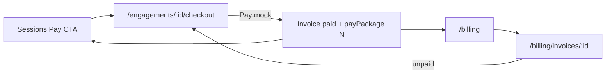

# Plan: Checkout (4+) + Billing

**Status:** Implemented (Phase 1 mocks)  
**Depends on:** Learn / Sessions engagement flow  
**Phase:** 1 mocks (no Stripe)

---

## Summary

Guardians must be able to **buy 4 or more sessions** (not a fixed pack of 4), see an **invoice-style checkout**, and manage history on a **Billing** page.

---

## Locked defaults (change if you disagree)

| Topic | Default |
|-------|---------|
| Quantity | Stepper / input, **minimum 4**, any integer ≥ 4 (5, 6, 7… OK) |
| Checkout | Invoice preview (line items, subtotal, total) then mock Pay |
| Billing | Invoice list (Open / Paid) + invoice detail; unpaid → checkout |
| Card UI | Fake “•••• 4242” on checkout only — no payment-methods manager yet |
| Credits | Paying **N** marks the next **N** unpaid scheduled sessions as paid |



---

## 1. Data model

```ts
type InvoiceStatus = 'draft' | 'open' | 'paid' | 'void'

interface InvoiceLine {
  description: string
  quantity: number
  unitAmountUsd: number
}

interface Invoice {
  id: string
  engagementId: string
  teacherId: string
  status: InvoiceStatus
  sessionCount: number // >= 4
  lines: InvoiceLine[]
  subtotalUsd: number
  totalUsd: number
  currency: 'USD'
  createdAt: string
  paidAt?: string
  invoiceNumber: string // e.g. INV-1003
}
```

Keep `PACKAGE_SESSION_COUNT = 4` as the **minimum**, not a fixed pack size.

---

## 2. Store

Files: [`src/types.ts`](../src/types.ts), [`src/mocks/store.ts`](../src/mocks/store.ts), seeds in [`src/mocks/data.ts`](../src/mocks/data.ts)

- Seed: 1 paid invoice (active teacher), 1 open invoice (awaiting payment).
- APIs:
  - `createInvoice(engagementId, sessionCount)` — reject if `sessionCount < 4`
  - `listInvoices()` / `getInvoice` / `useInvoices`
  - `payInvoice(invoiceId)` → status `paid` + existing `payPackage(engagementId, sessionCount)`
- Notifications link to checkout (or open invoice).

---

## 3. Checkout UI

| Route | Behavior |
|-------|----------|
| `/engagements/:id/checkout` | Qty ≥4 + invoice panel + Pay |
| `/engagements/:id/pay` | Redirect → checkout (compat) |

Replace thin [`PayEngagementPage.tsx`](../src/pages/PayEngagementPage.tsx) with checkout that shows:

- Teacher, subject, learners
- Session count (− / + , min 4)
- Invoice: number, line (`N × {subject} with {teacher}`), rate, qty, total
- Mock payment method
- **Pay $X** → create/pay invoice → receipt or Sessions

Sessions CTAs: “Pay for sessions” → `/engagements/:id/checkout`.

---

## 4. Billing page

| Route | Screen |
|-------|--------|
| `/billing` | List Open / Paid; amounts; links |
| `/billing/invoices/:id` | Full invoice; if `open` → Pay now (checkout with qty) |

Nav: add **Billing** (desktop + mobile More).

---

## 5. Copy / docs

- Hire / notifications: “**at least** 4 sessions”.
- Update [`PLAN.md`](./PLAN.md); add short PRD section or fold into engagement PRD.

---

## Out of scope

- Real Stripe, tax, refunds  
- Saved-card CRUD  
- Teacher payouts  
- Auto-renew charges  

---

## Acceptance

1. Checkout allows **4, 5, and 8**; totals update; calendar marks that many paid.  
2. Checkout looks like an invoice before pay.  
3. `/billing` lists invoices; open can pay; paid is receipt-only.  
4. Cannot select fewer than 4.

---

## Implementation order

1. Invoice types + seed + store  
2. Checkout page + `/pay` redirect  
3. Billing list + detail + nav  
4. CTA / notification / docs updates  
