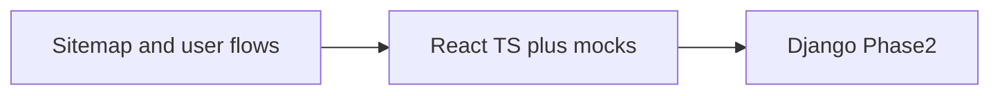
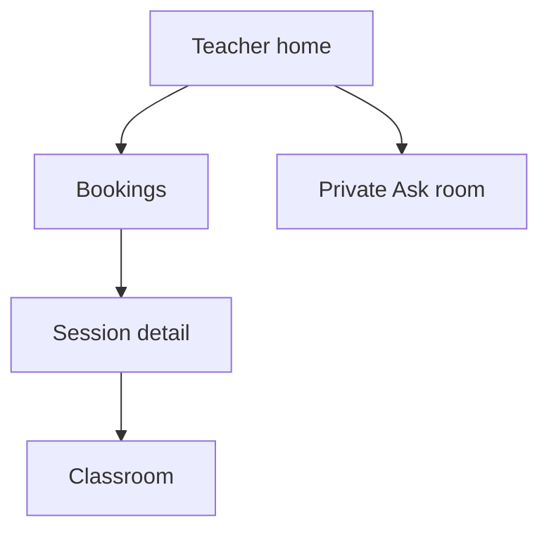

# Quran Teaching Platform — Product & Build Plan

## What this UI plan is called

Defining screens and **where each button takes the user** is typically called:

| Term | What it covers |
|------|----------------|
| **User flows** (or UX / task flows) | Step-by-step paths for a goal (e.g. “hire a teacher”) and destinations of actions |
| **Sitemap** / **screen map** | Inventory of all screens and hierarchy |
| **Information architecture (IA)** | How content and navigation are organized |
| **Wireflows** | Wireframes + flows combined (next step after this doc) |

**Short answer:** people usually say **“user flows”** (for button → screen paths) plus a **“sitemap”** (for the full screen list). The section below is both.

---

## Build strategy (locked)

**Phase 1 — UI only (first month)**  
- React + TypeScript, mock/test data, no Django  
- Build screens to match the **sitemap + user flows** below  

**Phase 2 — Backend**  
- Django API replaces mocks; LiveKit, Stripe, storage, email  

---

# UI plan: sitemap & user flows

## First screens (everyone)

1. **Landing `/`**  
   - `Browse teachers` → `/teachers`  
   - `Ask a scholar` → `/ask`  
   - `Log in` → `/login`  
   - `Sign up` → `/signup`  

2. **Sign up `/signup`** — choose **Student** or **Apply as teacher** → role home  

3. **Log in `/login`** → role home  

4. **Phase 1 demo:** header **persona switcher** — Student / Teacher / Forum scholar / Admin  

## App shell (logged in)

- **Logo** → role home  
- **Bell** → `/notifications`  
- **Avatar** → Profile / Settings / Log out / Switch persona  
- **Side nav** — items depend on role (below)  

---

## Platform 1 — Guardian (family account)

The logged-in account is an **adult guardian** who can **also learn as themselves**. Kids are additional learners. There is **no header “active kid” switcher** — the family is managed together. Choose who a booking / Ask / course is for **at action time**. When a class is starting, use the **join learner picker**.

### Side nav
Home · Family · Teachers · Sessions · Ask Scholars · Courses · Progress · Homework · Practice · Library · Office hours · Premium

### Sitemap

| Route | Screen |
|-------|--------|
| `/app` | Family home — you + kids progress; join-class picker when sessions are accepted |
| `/kids` | Family manage — you + kids list / add / edit / remove |
| `/kids/new` | Add kid |
| `/kids/:id` | Learner hub (you or a kid) |
| `/kids/:id/edit` | Edit kid |
| `/teachers` | Directory (`?for=` optional preselect) |
| `/teachers/:id` | Teacher profile |
| `/teachers/:id/book` | Book 1:1 — **learner picker** (you or kid) required |
| `/sessions` | All family sessions (filter chips by learner) |
| `/sessions/join` | **Join picker** — whose accepted class to enter |
| `/sessions/:id` | Detail |
| `/sessions/:id/room` | Classroom |
| `/ask` | Family Ask list |
| `/ask/new` | Compose — **learner picker** (who is asking) |
| `/ask/:id` | Thread |
| … | (courses, progress, etc. as before; course enroll will use the same learner picker) |

### Key flows

**Hire for you or a kid:** Teachers → Profile → Book → pick learner → slot → Sessions  

**Join when class starts:** Home “Class starting” / `/sessions/join` → pick learner’s accepted session → room  

**Ask:** `/ask/new` → pick who is asking → submit  

---

## Platform 2 — Teacher / Scholar

Pending teachers: banner + application status only.  
Approved: full nav.  
Forum scholar: extra Ask private rooms.

### Side nav
Home · Bookings · Sessions · Availability · My profile · Courses · Library · Practice inbox · Office hours · Ask Scholars · Notifications

### Sitemap

| Route | Screen |
|-------|--------|
| `/teacher` | Teacher home |
| `/teacher/apply` | Application or pending status |
| `/teacher/availability` | Schedule editor |
| `/teacher/profile/edit` | Bio, subjects, rate, badges (read-only display) |
| `/teacher/bookings` | Requests accept/decline |
| `/teacher/sessions/:id` | Post-session: hifz, notes, homework |
| `/teacher/sessions/:id/room` | 1:1 classroom shell |
| `/teacher/courses` | My courses |
| `/teacher/courses/new` | Create |
| `/teacher/courses/:id` | Edit, resources, roster |
| `/teacher/courses/:id/room` | Group room shell |
| `/teacher/library` | Upload/manage resources |
| `/teacher/practice` | Student attempts inbox |
| `/teacher/practice/:id` | Timestamp comments |
| `/teacher/office-hours` | Schedule |
| `/ask` | Question list |
| `/ask/:id` | Public thread |
| `/ask/:id/scholar` | **Private scholar room** (chat, drafts, Agree) |
| `/notifications` | Inbox |
| `/settings` | Settings |

### Teacher home `/teacher` — first screen
- Pending requests → `/teacher/bookings`  
- Today’s sessions → session detail / `Join` room  
- Practice inbox count → `/teacher/practice`  
- If forum scholar: open Ask items → `/ask/:id/scholar`  
- If pending: `View application` → `/teacher/apply`  

### Key teacher / scholar flows

**Apply → approved:** Apply form → pending home → (admin approves) → full home  

**Booking:** Notification / bookings → `Accept` or `Decline` → session detail → `Join classroom` → after: notes, homework, update Hifz  

**Ask (forum scholar):** Notification → `/ask/:id/scholar` → discuss → `Create draft` → others `Agree` → at 2 agrees published → `View public thread`  

**Recitation:** Practice inbox → open attempt → add comments at times → `Send feedback` → student sees on `/practice/:id`  

---

## Platform 3 — Admin

### Side nav
Home · Applications · Users · Ask moderation · Notifications

### Sitemap

| Route | Screen |
|-------|--------|
| `/admin` | Admin home |
| `/admin/applications` | Queue |
| `/admin/applications/:id` | Approve / reject / needs info + badge toggles + Forum scholar flag |
| `/admin/users` | User list |
| `/admin/ask` | Threads needing attention |
| `/admin/ask/:id` | Force publish / close; peek private room |
| `/notifications` | Inbox |
| `/settings` | Settings |

### Admin home — first screen
- `Pending applications (N)` → queue  
- `Ask threads stuck` → Ask moderation  
- Quick link Users  

### Key admin flow
Applications list → detail → set badges → `Approve` / `Reject` / `Needs info` → back to queue  

---

## Classroom shell (shared pattern)

Routes: `/sessions/:id/room`, `/teacher/sessions/:id/room`, `/courses/:id/room`, `/teacher/courses/:id/room`

| Control | Result |
|---------|--------|
| Tab Video / PDF / Whiteboard / Chat | Switch panel (mock) |
| Teacher: prev/next page, highlight | PDF mock updates |
| `Leave` | Session or course detail |
| Teacher `End session` | Session detail + notes/homework prompts |

---

## Notifications → destinations

| Notification | Goes to |
|--------------|---------|
| Booking request | `/teacher/bookings` |
| Booking accepted | `/sessions/:id` |
| New Ask question | `/ask/:id/scholar` |
| Answer published | `/ask/:id` |
| Homework assigned | `/homework` |
| Practice feedback | `/practice/:id` |
| Office hours soon | `/office-hours` |

---

## Phase 1 build order (follow flows)

1. Shell + landing + auth + persona switcher  
2. Student directory → hire → sessions → room shell  
3. Teacher apply/bookings/session + Admin applications/badges  
4. Ask Scholars (public + private + publish) + notifications  
5. Courses + Premium  
6. Progress, homework, library, practice, reviews  
7. Office hours + empty/loading/error states  

---

## Product judgment (locked)

- Vetting + public badges; browse/hire (no matching)  
- Ask Scholars: private deliberation → publish at **drafter + ≥1 agree**  
- Phase 1 classroom = shells; Phase 2 = LiveKit/pdf/tldraw  
- Free vs Premium paywall UI in Phase 1  

### Learning features in UI
- Hifz/progress, notes/homework, badges, reviews, resource library, recitation + timestamp comments  

---

## Phase 1 stack

| Layer | Choice |
|-------|--------|
| UI | Vite + React + TypeScript |
| Routing | React Router (routes = sitemap above) |
| Styling | Tailwind or CSS modules at scaffold |
| Data | Typed mocks behind `src/api` interface |
| Classroom | Placeholders only |

**Phase 2:** Django, Postgres, LiveKit, Stripe, storage, email  

---

## Mock architecture

Pages → `api` interface → mock adapters (Phase 1) → later Django HTTP adapters  

Seed: ~8 teachers (mixed badges), students, bookings, Ask threads (under review + published), courses, hifz, practice, reviews  

---

## Success criteria (Phase 1)

- Every sitemap route exists and is navigable with test data  
- Demo works as Student, Teacher, Forum scholar, Admin  
- Every primary button matches the flows above  
- Ready for Django swap without rewriting page structure  

---

## Confirm before build

- This **sitemap + user flows** doc is the UI source of truth  
- Phase 1 = UI + mocks only  
- No code until you explicitly say to start building  
